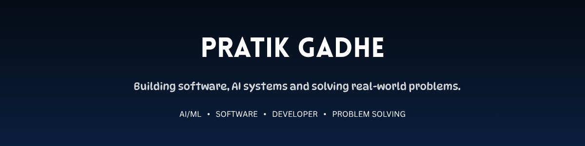

## 👋 About Me

I'm a Computer Engineering student exploring AI/ML and software
development. I enjoy turning ideas into working products,
especially projects involving intelligent systems, automation,
and real-world problem solving.

> 🔭 **Currently exploring:** AI Agents • RAG • LLM Applications • Machine Learning

## 🚀 Currently Building

### VYASA

**Vision-augmented Yield & Agentic Synthesis Architecture**

A sovereign, on-premise multimodal agentic AI workbench
designed for confidential industrial workflows, combining
agentic reasoning, visual understanding, and grounded knowledge
retrieval.

**Stack:** React • FastAPI • LangGraph • Ollama • Qwen3 • Qwen3-VL • ChromaDB

> 🚧 **Status:** Actively developing

🔗 **[View Repository](https://github.com/PratikGadhe/SIH-26117)**

## 🧩 Selected Builds

### 🛍️ NEXORA

**Offline-first shopping platform with store-aware inventory and QR-based interaction.**

Built to explore a more connected offline shopping experience...

**Stack:** React Native • Expo • FastAPI • PostgreSQL • Alembic

🔗 **[View Repository](https://github.com/PratikGadhe/Nexora-offline-shopping-mart)**

---

### 🏙️ Resolve360

**AI-assisted civic issue reporting and management platform.**

Designed to help citizens report civic problems...

**Stack:** React Native • Flask • Python • Machine Learning • SQLite

🔗 **[View Repository](https://github.com/PratikGadhe/civic-reporter-app)**

---

### ♻️ Incentivized Plastic Recycling Machine

**A smart recycling system combining barcode scanning, image processing,
and automated sorting with reward-based interaction.**

Built using computer vision and hardware integration...

**Stack:** Python • OpenCV • Arduino • SQLite

🔗 **[View Repository](https://github.com/PratikGadhe/Major-Project-RVM-Machine-Code)**

## 🏆 Achievements

| Result | Event / Competition | Project / Category |
|---|---|---|
| 🥇 **Winner** | **Technova 2026** | Project Competition |
| 🥇 **1st Position** | **Crezona 2025** | Coding Competition |
| 🥈 **2nd Position** | **Launchspire 2.0** | Startup Idea Presentation |
| 🥈 **Runner Up** | **Technocave 2025** | Incentivized Plastic Recycling Machine |
| 🥈 **2nd Position** | **Project Competition** | NEXORA |
| 🚀 **Advanced to Next Round** | **Smart India Hackathon 2026** | Problem Statement 26117 |

> 🚀 **SIH 2026:** Building **VYASA** for Problem Statement 26117 — *Sovereign On-Premise Agentic AI Workbench using Open-Weight Multimodal LLMs for Confidential Industrial Work.*

## 🛠️ Tech Stack

### 💻 Languages

  

### 🤖 AI / ML

  

### 🧠 AI Engineering

  

`LangGraph` • `Ollama` • `Qwen3` • `Qwen3-VL` • `ChromaDB`

### 🌐 Development

  

`React Native` • `Expo`

### 🔧 Tools & Platforms

  

## 📊 GitHub in Numbers

## 🐍 Watch the snake eat my contributions

  <picture>
    <source
      media="(prefers-color-scheme: dark)"
      srcset="https://raw.githubusercontent.com/PratikGadhe/PratikGadhe/output/github-snake-dark.svg"
    />
    <source
      media="(prefers-color-scheme: light)"
      srcset="https://raw.githubusercontent.com/PratikGadhe/PratikGadhe/output/github-snake.svg"
    />
    
  </picture>

## 🤝 Connect

